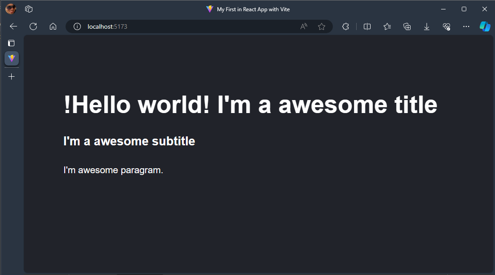

# My First in React App with Vite

## Description: 
Simple application made in React JS using Vite which displays in the HTML view a title, subtitle and paragraph sent from the component.

## Preview
<picture>
    <source media="(prefers-color-scheme: dark)" srcset="./preview.png">
    <source media="(prefers-color-scheme: light)" srcset="./preview.png">
    
</picture>

## Plugins React + Vite 
<!--
---

-->

Currently, two official plugins are available:

- [@vitejs/plugin-react](https://github.com/vitejs/vite-plugin-react/blob/main/packages/plugin-react/README.md) uses [Babel](https://babeljs.io/) for Fast Refresh
- [@vitejs/plugin-react-swc](https://github.com/vitejs/vite-plugin-react-swc) uses [SWC](https://swc.rs/) for Fast Refresh
